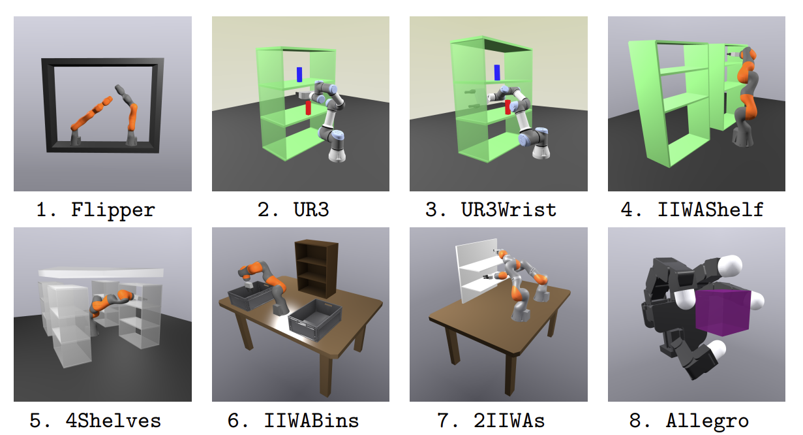

# URDF and YAML Files for Benchmark Scenes as Seen in [Werner et. al.](https://groups.csail.mit.edu/robotics-center/public_papers/Werner24.pdf)

Run `python scene_tester.py` to visualize a scene in Meshcat.

### All 8 Scenes Work!
&nbsp;&nbsp;&nbsp;✅ 3DOFFLIPPER 
&nbsp;&nbsp;&nbsp;✅ 5DOFUR3 
&nbsp;&nbsp;&nbsp;✅ 6DOFUR3 
&nbsp;&nbsp;&nbsp;✅ 7DOFIIWA 
&nbsp;&nbsp;&nbsp;✅ 7DOF4SHELVES 
&nbsp;&nbsp;&nbsp;✅ 7DOFBINS 
&nbsp;&nbsp;&nbsp;✅ 14DOFIIWAS 
&nbsp;&nbsp;&nbsp;✅ 15DOFALLEGRO 
