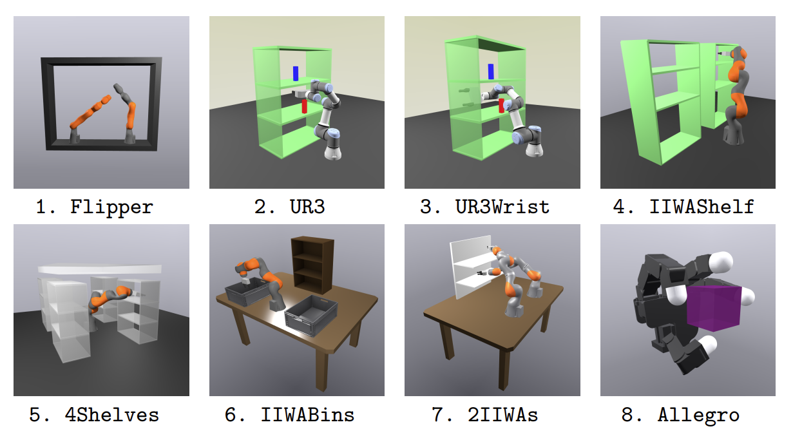

# URDF and YAML Files for Benchmark Scenes as Seen in [Werner et. al.](https://groups.csail.mit.edu/robotics-center/public_papers/Werner24.pdf)



Plus one more scene -- `2DOFFLIPPER` which makes it easier to visualize algorithms (since the configuration space is 2D).

Run `python scene_tester.py` to visualize a scene in Meshcat.

Run `python template_teleop_simple.py` to teleoperate a robot in a scene.

### Recommended Usage

1. `git submodule add https://github.com/Michaelszeng/iris_benchmarks_scenes_urdf`

2. Add the following code to the top of your test file to locate the yaml file for the desired scene and create a `MultibodyPlant` from it:

```python
# TEST_SCENE = "2DOFFLIPPER"
# TEST_SCENE = "3DOFFLIPPER"
# TEST_SCENE = "5DOFUR3"
# TEST_SCENE = "6DOFUR3"
TEST_SCENE = "7DOFIIWA"
# TEST_SCENE = "7DOFBINS"
# TEST_SCENE = "7DOF4SHELVES"
# TEST_SCENE = "14DOFIIWAS"
# TEST_SCENE = "15DOFALLEGRO"

parent_directory = os.path.dirname(os.path.abspath(__file__))
data_directory = os.path.join(parent_directory)
scene_yaml_file = os.path.join(data_directory, "iris_benchmarks_scenes_urdf", "yamls", TEST_SCENE + ".dmd.yaml")

robot_diagram_builder = RobotDiagramBuilder()
parser = robot_diagram_builder.parser()
iris_environement_assets = os.path.join(data_directory, "iris_benchmarks_scenes_urdf", "iris_environments", "assets")
parser.package_map().Add("iris_environments", iris_environement_assets)

...
```

Alternatively, see the `template_plant_builder.py` and/or `template_station_builder.py` to see full examples of building a Drake `MultibodyPlant` or a `HardwareStation` from the yaml files.
